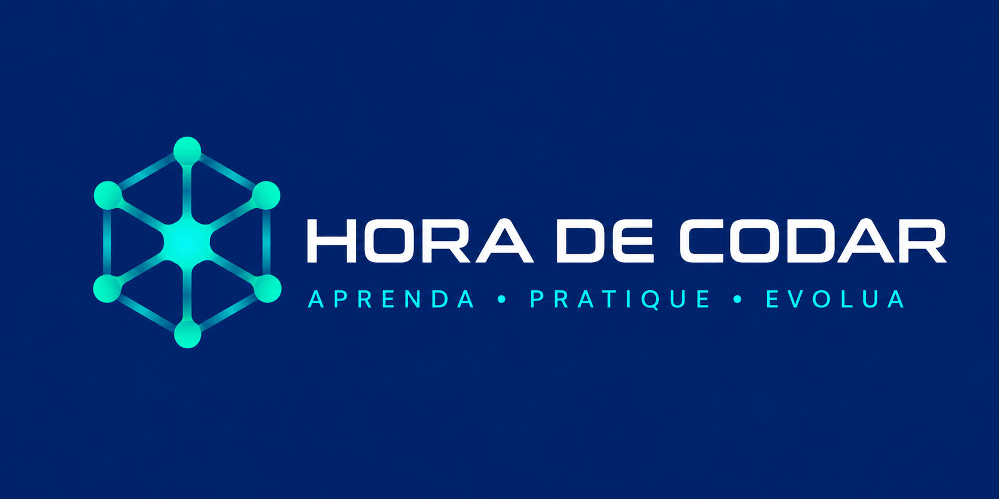

  

# Curso Python - Hora de Codar 🧠

Repositório destinado aos exercícios, desafios e projetos desenvolvidos durante o curso "Python do Básico ao Avançado" da Hora de Codar.

## Conteúdo

- Fundamentos da linguagem
- Estruturas condicionais
- Estruturas de repetição
- Funções
- Listas
- Modularização
- Projetos práticos

## Objetivo

Registrar minha evolução e os conhecimentos adquiridos ao longo do curso.
